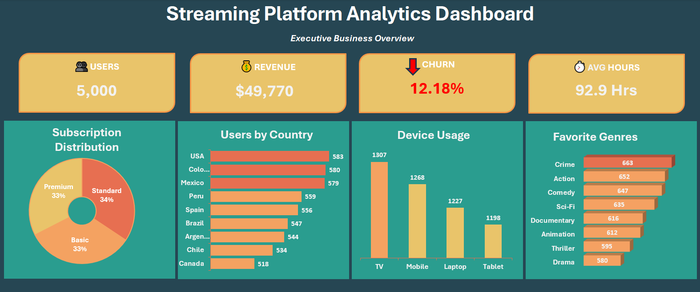

# Streaming Platform Analytics

## Project Overview

This project focuses on analyzing a streaming platform dataset to identify trends in user engagement, revenue performance, and content consumption.

The goal is to transform raw data into meaningful insights through data cleaning, analysis, and dashboard creation using Excel.

## Business Problem

The streaming platform needed to better understand user engagement, content performance, and revenue trends. By analyzing key performance indicators (KPIs), this project aims to identify actionable insights that support data-driven business decisions.

## Dataset

The dataset contains simulated streaming platform data, including user activity, subscriptions, revenue, content categories, regions, and engagement metrics.

The data was prepared and analyzed using Microsoft Excel and Power Query.

## Tools Used

- Microsoft Excel
- Pivot Tables
- Power Query
- Data Visualization

## Skills Demonstrated

- Data Cleaning
- Data Analysis
- Dashboard Design
- KPI Reporting
- Pivot Tables
- Power Query
- Business Analysis
- Data Visualization

## Project Objectives

- Analyze key business performance indicators (KPIs)
- Understand user behavior and engagement patterns
- Identify trends in content performance.
- Create an interactive dashboard for decision-making.

## Dashboard Preview

## Key Insights

- Identified trends in user engagement and content consumption.
- Analyzed revenue performance and key business indicators.
- Evaluated content performance to understand audience preferences.
- Discovered patterns that can support data-driven decisions.

## Business Recommendations

- Focus on high-performing content categories to maximize user engagement.
- Use audience behavior data to improve content recommendations.
- Monitor key performance indicators (KPIs) regularly to support decision-making.
- Develop strategies focused on user retention and revenue growth.
